# ForoHub API 📚💻
[](LICENSE)
[](https://www.oracle.com/java/technologies/downloads/)
[](https://spring.io/projects/spring-boot)
[](https://maven.apache.org/)
[](https://spring.io/projects/spring-security)
[](https://jwt.io/)
[](https://github.com/auth0/java-jwt)
[](https://www.mysql.com/)
[](https://flywaydb.org/)
[](https://projectlombok.org/)

Proyecto desarrollado como parte del **Challenge Back End - Alura Latam**.  
El objetivo es construir una API REST para un foro de discusión, donde estudiantes y profesores pueden crear tópicos, responderlos y mantener la colaboración.
Ahora la API cuenta con autenticación y autorización con JWT 🔐.

---

## 🚀 Tecnologías utilizadas
- **Java 17**
- **Spring Boot 3**
- **Spring Data JPA**
- **Spring Validation**
- **Flyway** (migraciones de base de datos)
- **MySQL 8**
- **Lombok**
- **Auth0 Java JWT**

---
## ⚙️ Instalación y configuración
### 1️⃣ Clonar el repositorio
```
git clone https://github.com/tu-usuario/foro-hub.git
cd foro-hub
```
### 2️⃣ Configurar base de datos
```
CREATE DATABASE foro_hub;
```
### 3️⃣ Variables de entorno
En tu sistema o en IntelliJ IDEA / Spring Boot run configuration, define:
```
DB_HOST=localhost
DB_NAME=foro_hub
DB_USER=usuario
DB_PASSWORD=password
JWT_SECRET=clave_secreta
```
Estas variables son usadas en `applications.properties`

### 4️⃣ Ejecutar migraciones
Migraciones gestionadas con **Flyway** (`db/migration`):
- `V1__create_table_usuarios.sql`
- `V2__create_table_perfiles.sql`
- `V3__create_table_usuarios_perfiles.sql`
- `V4__create_table_cursos.sql`
- `V5__create_table_topicos.sql`
- `V6__create_table_respuestas.sql`

Además, se incluyen **semillas iniciales** (`INSERT`) para:
- Usuarios (perfiles `ROLE_ADMIN`, `ROLE_MODERATOR`, `ROLE_PROFESSOR`, `ROLE_USER` )
- Cursos
- Usuario administrador (`admin@forohub.com / admin123`)
- Usuario estudiante (`user_student@forohub.com / user123`)

### 5️⃣ Correr la aplicación

```
./mvnw spring-boot:run
```
o desde IntelliJ ejecutando la clase principal `ForoHubApplication`.

---

## 📌 Endpoints implementados
Por defecto, la app levanta en:
```
http://localhost:8080
```
### 🔐 Autenticación con JWT
- **Login**:
  - `POST /auth/login`
  - Ingresa credenciales ingresadas de usuario: email y password y devuelve un token
  - Una vez obtenido el token, este se debe enviar en el header de cada request

### 🔹 Tópicos
- **Crear** un tópico:
    - `POST /topicos`
    - Validaciones:
        - No permitir tópicos duplicados con mismo título y mensaje.
        - Usuario y curso deben existir en BD.
    - Errores controlados:
        - `400` → Datos inválidos.
        - `404` → Usuario/curso no existe.
        - `422` → Duplicado.
 
- **Listar tópicos**
    - `GET /topicos`
    - Devuelve un listado resumido de todos los tópicos creados.
    - Filtros opcionales
      - `anio` (Integer) – Año de creación del tópico (ej. `2025`)
      - `cursoId` (Long) – Id del curso

    - Se pueden combinarlos libremente:
      - Todos:  
        `GET /topicos`
      - Por año:  
        `GET /topicos?anio=2025`
      - Por curso:  
        `GET /topicos?cursoId=1`
      - Por año y curso:  
        `GET /topicos?anio=2025&cursoId=1`

- **Listar detalle de un tópico**
    - `GET /topicos/{id}`
    - Devuelve los datos de un tópico específico.
    - `404` si no existe.

- **Actualizar** un tópico:
    - `PUT /topicos/{id}`
    - Se pueden modificar: `titulo`, `mensaje`, `status`, `cursoId`.
    - Valida duplicados y existencia de curso.
    - `404` o `422` según corresponda.

- **Eliminar** un tópico:
    - `DELETE /topicos/{id}`
    - Elimina solo si existe, en caso contrario devuelve `404`.

---

## 🛠️ Manejo de errores

Centralizado en `GlobalExceptionHandler`:
- **404**: recurso no encontrado (`EntityNotFoundException`)
- **400**: validaciones de campos (`MethodArgumentNotValidException`)
- **422**: recurso duplicado (`DuplicateResourceException`)

---
## 📬 Ejemplos de requests (Insomnia/Postman)
### Login 
- Request
```json
{
  "email": "user_student@forohub.com",
  "password": "user123"
}
```
- Response
```json
{
  "token": "eyJhbGciOiJIUzI1NiJ9...",
  "type": "Bearer"
}
```

### Crear tópico
```json
POST /topicos
{
  "titulo": "Problema con JPA",
  "mensaje": "No me reconoce la anotación @Entity.",
  "autorId": 1,
  "cursoId": 1
}
```
### Actualizar tópico
```json
PUT /topicos/1
{
"titulo": "Problema con Maven",
"mensaje": "Error al compilar.",
"status": "CERRADO",
"cursoId": 1
}
```
### Eliminar tópico
```json
DELETE /topicos/1
```
## 📸 Capturas

- ### Login
  - Login exitoso
  
  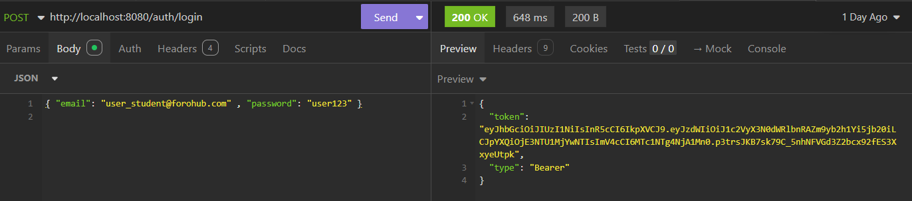

  - Error en el login
  
  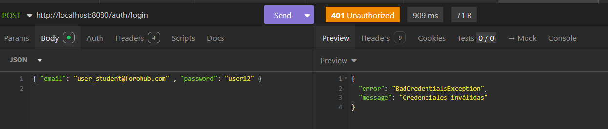

- ### Crear tópico exitoso ✅

    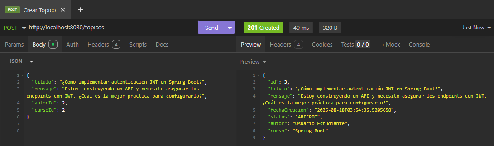

- ### Actualización de tópico ✏️

    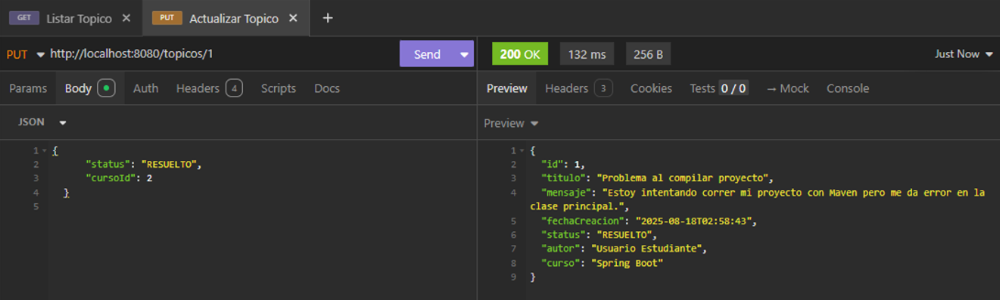

- ### Eliminación de tópico 🗑️
    
    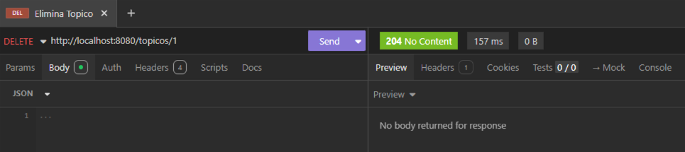

- ### Listar tópico por ID 🔎
    
    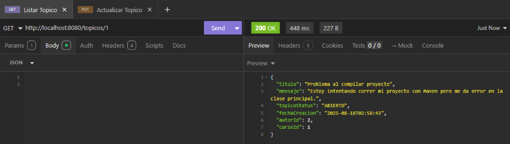

  - ### Listar todos los tópicos 📑

    - Listar todos sin filtros

    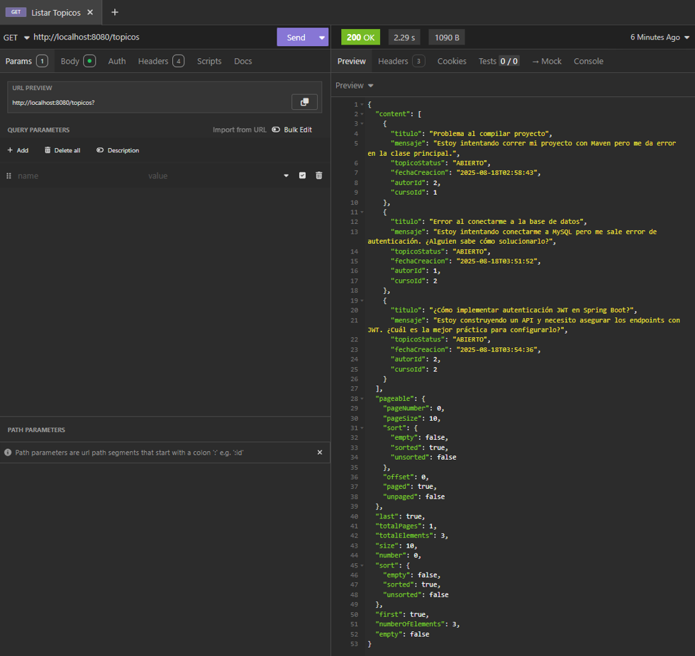
  
  - Listar topicos con filtros opcionales: 
    
    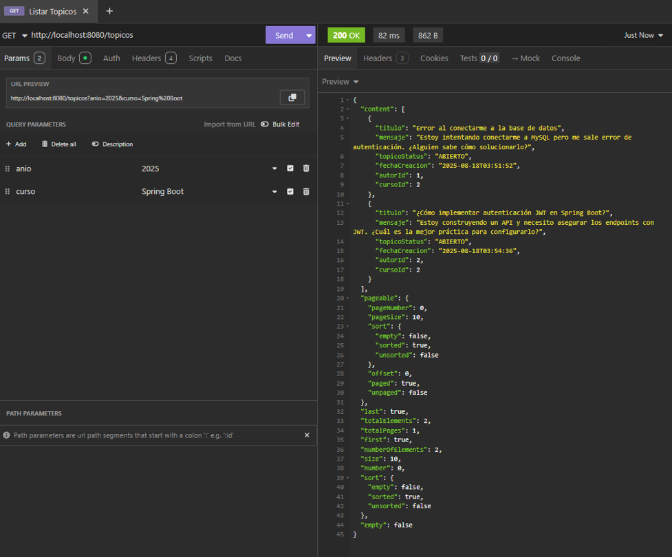 

- ### Validación 400 (Bad Request) 🚫
  
    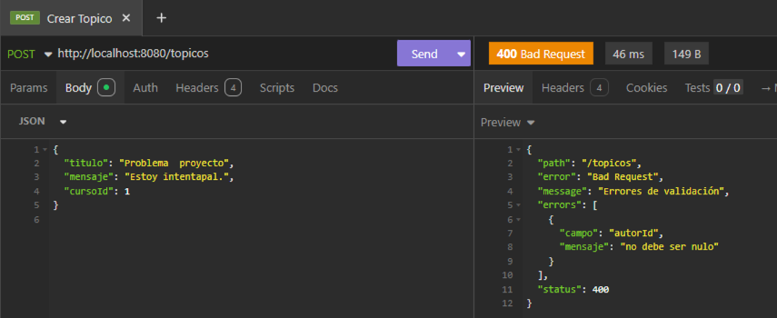

  - ### Validación 404 (Usuario, curso, topico no existe) 🚫

      - Crear Topico
      
        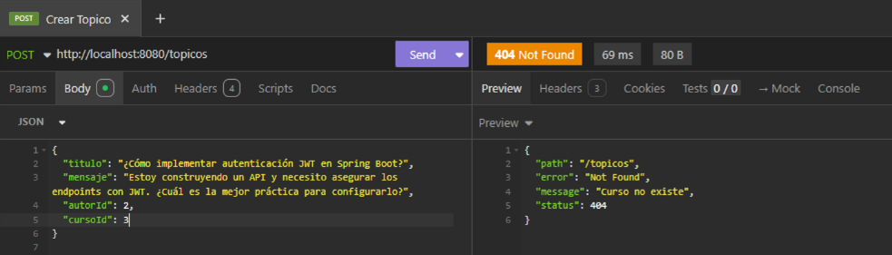
    
        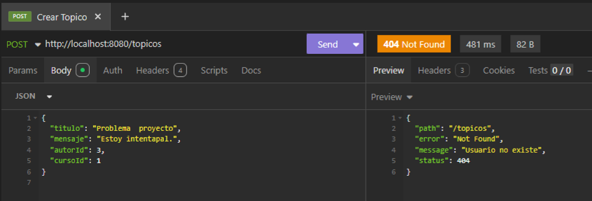

      - Listar Topico
        
        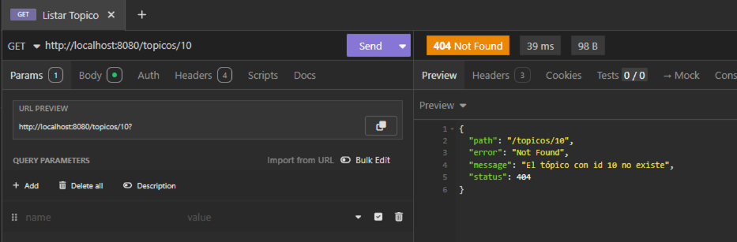
    
      - Actualizar topico
    
        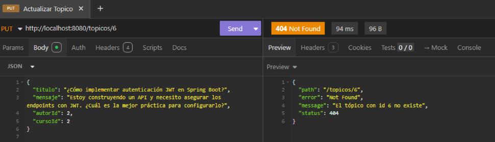
    
      - Eliminar topico
        
        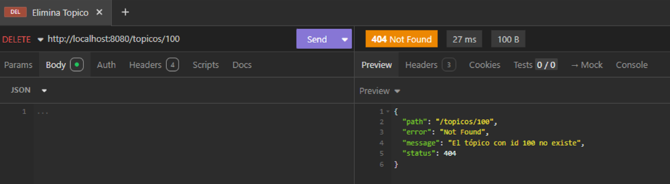

- ### Validación 422 (Tópico duplicado) 🚫

  - Crear Topico
        
    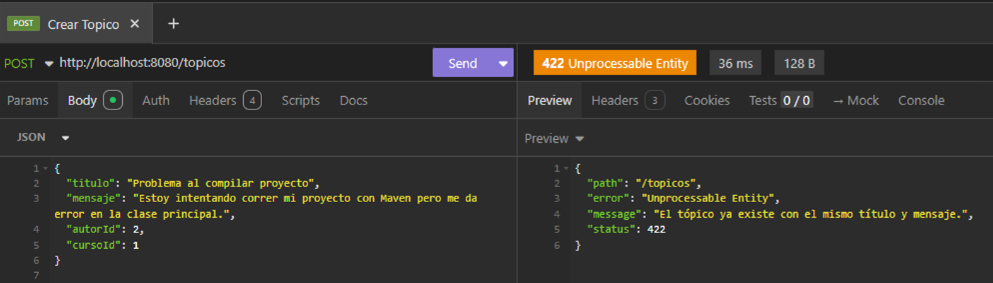
  
  - Actualizar topico
  
    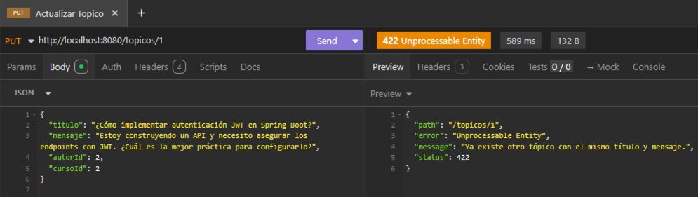

---

## 👨‍💻 Autor

Proyecto desarrollado como parte del Challenge Back End de Alura Latam.